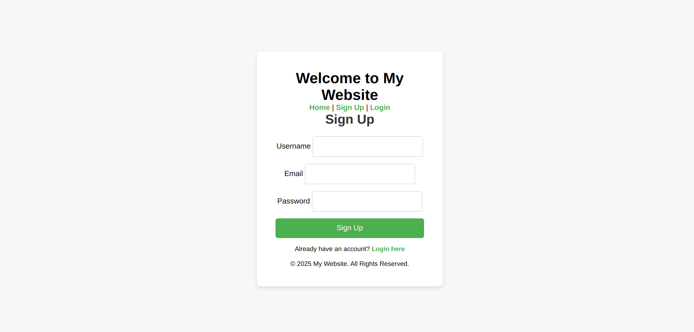
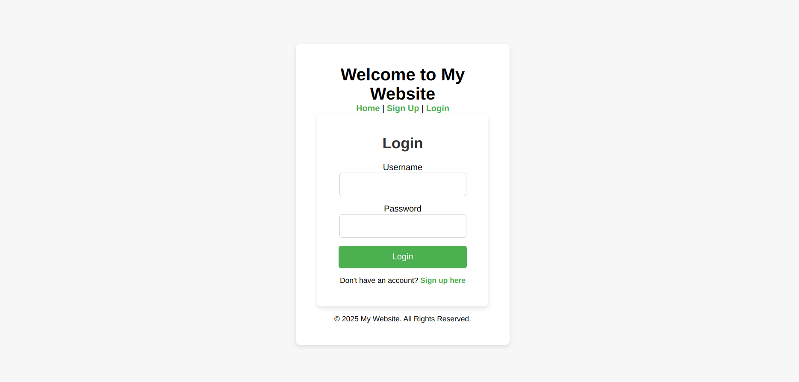
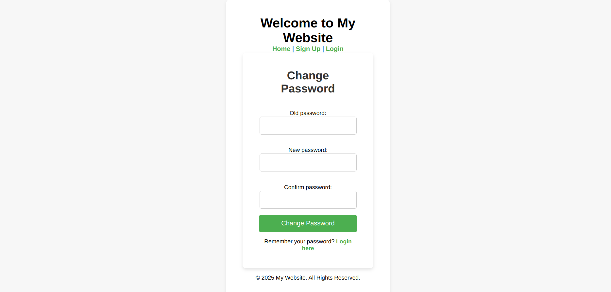
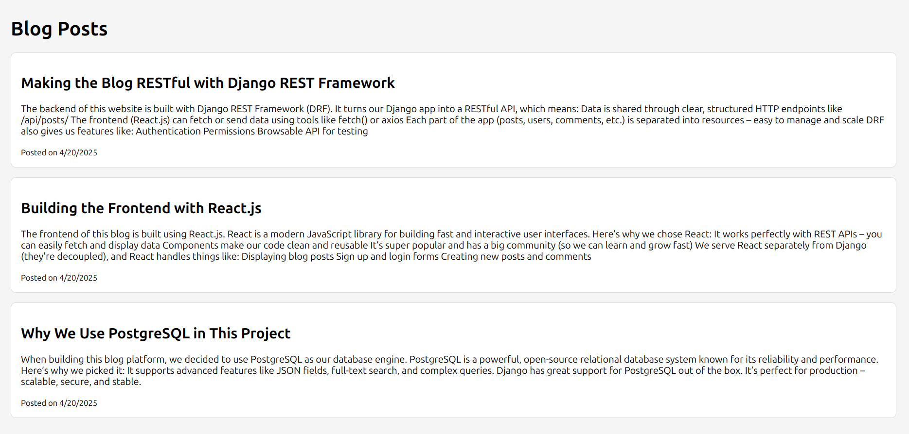

# 📝 Blog App

A modern blog application built with **Django REST Framework** on the backend and **React** on the frontend.  
Users can create accounts, log in, write blog posts, and explore content posted by others.

---

## 🚀 Features

- 🔐 User authentication (Sign Up / Login)
- 📬 Create, Read, Update, Delete (CRUD) blog posts
- 📚 REST API powered by Django REST Framework
- ⚛️ React frontend with clean and responsive design
- 🌐 Token-based authentication (using JWT)
- 💾 PostgreSQL as the database

---

## 📸 Screenshots

### Create Account Page



### Login Page



### Change Password Page



### Home Page




---

## 🔧 Tech Stack

### Backend:
- Python
- Django
- Django REST Framework (DRF)
- Simple JWT
- PostgreSQL

### Frontend:
- React
- Axios
- React Router

---

## 🛠️ Installation & Setup

### 📦 Backend (Django)

```bash
# Clone the repo
git clone https://github.com/yourusername/blog-app.git
cd blog-app/backend

# Create virtual environment
python3 -m venv venv
source venv/bin/activate

# Install dependencies
pip install -r requirements.txt

# Setup database and run server
python manage.py migrate
python manage.py runserver
```
### 🌐 Frontend (React)

```bash
# Go to blog-frontend
cd ../frontend

# Install dependencies
npm install

# Run development server
npm start
```
## 📬 API Endpoints

### 🔐 Authentication (Accounts)

| Method | Endpoint                      | Description            |
|--------|-------------------------------|------------------------|
| POST   | `/accounts/signup/`           | Register new user      |
| POST   | `/accounts/login/`            | Login user (get token) |
| POST   | `/accounts/logout/`           | Logout user            |
| POST   | `/accounts/change-password/`  | Change user password   |

### 📝 Blog & Comments API

| Method | Endpoint             | Description              |
|--------|----------------------|--------------------------|
| GET    | `/api/posts/`        | List all posts           |
| POST   | `/api/posts/`        | Create a new post        |
| GET    | `/api/posts/:id/`    | Retrieve single post     |
| PUT    | `/api/posts/:id/`    | Update post              |
| DELETE | `/api/posts/:id/`    | Delete post              |
| GET    | `/api/comments/`     | List all comments        |
| POST   | `/api/comments/`     | Create a new comment     |
| GET    | `/api/comments/:id/` | Retrieve single comment  |
| PUT    | `/api/comments/:id/` | Update comment           |
| DELETE | `/api/comments/:id/` | Delete comment           |

### 🧠 Future Improvements
- 🗂️ Categories & Tags for blog posts
- 🖼️ Image upload support
- 🔍 Search functionality
- 💬 Comments system
- ❤️ Like & Bookmark system


### 🤝 Contributing
Pull requests are welcome! For major changes, please open an issue first to discuss what you would like to change.

### 📄 License
This project is licensed under the MIT License.

### 🔗 Contact
- Made with ❤️ by Nikan
- Feel free to connect on [LinkedIn](www.linkedin.com/in/nikanmafakheri)
